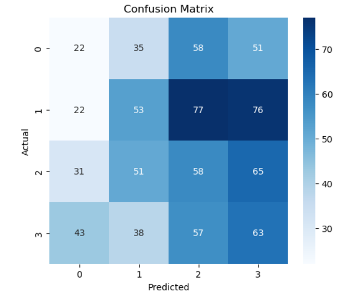

# Air Quality Classification Project 

## Overview
This project explores air quality data and demonstrates a **machine learning workflow** using Python and Jupyter Notebook. The goal is to **analyze air pollution** and **predict air quality classes** (Safe vs Unsafe) based on key pollutants and weather features.  

This project covers **data loading, exploration, preprocessing, modeling, evaluation, and visualization**.

---

## Dataset
- **File:** `AirQualityData.csv`  
- **Rows:** 4,000  
- **Columns:** 23, including:  
  - Pollutants: `CO(GT)`, `NOx(GT)`, `NO2(GT)`, `O3(GT)`, `SO2(GT)`, `PM2.5`, `PM10`  
  - Weather: `Temperature`, `Humidity`, `WindSpeed`  
  - Time features: `Date`, `Time`, `Hour`, `DayOfWeek`

---

## Steps Performed

1. **Data Loading**  
   - Loaded CSV into a Pandas DataFrame  
   - Checked column types, missing values, and basic statistics  

2. **Data Exploration & Visualization**  
   - Visualized correlations between PM2.5 and PM10  
   - Checked distributions and ranges of pollutants  
   - Noted patterns by hour/day  

   

3. **Feature Selection**  
   - Selected numeric features and relevant weather/time columns  
   - Target column for classification: `PM2.5` converted to classes  

4. **Target Transformation**  
   - Original 4-class AQ: Good / Moderate / Unhealthy / Hazardous  
   - Converted to **binary classes**:  
     - Safe (PM2.5 ≤ 100) → 0  
     - Unsafe (PM2.5 > 100) → 1  

5. **Train/Test Split**  
   - Split data into 80% training, 20% testing  

6. **Machine Learning Model**  
   - Trained a **Random Forest Classifier**  
   - Evaluated using:  
     - Accuracy  
     - Classification report (precision, recall, F1-score)  
     - Confusion matrix  

   

7. **Results & Observations**  
   - Overall accuracy: ~49% for binary classification  
   - Model tends to overpredict “Unsafe” class  
   - Confusion matrix and classification report included  

---
## Repository Structure
```
AirQualityClassification/
│
├─ AirQualityData.csv
├─ AirQualityPrediction.ipynb
├─ PM2.5 vs PM10.png
├─ Confusion Matrix.png
├─ Binary AQ Confusion Matrix.png
└─ README.md
```


## How to Run

### 1. Clone the Repository

### 2. Install Required Packages
```bash
pip install pandas matplotlib seaborn scikit-learn jupyter
```

### 3. Launch Jupyter Notebook
```bash
jupyter notebook AirQualityPrediction.ipynb
```

### 4. Execute the Analysis
Run the cells sequentially in the notebook. All visualizations and evaluation metrics will be displayed inline.

## Conclusion

This project successfully demonstrates an end-to-end machine learning workflow for environmental data analysis. Key accomplishments include:

Comprehensive exploration and visualization of atmospheric pollutants
Transformation of continuous PM2.5 measurements into actionable air quality classifications
Development of a Random Forest classifier for binary air quality prediction
Generation of interpretable visualizations and performance metrics

Note: The moderate accuracy (~49%) suggests opportunities for improvement through feature engineering, hyperparameter tuning, or alternative modeling approaches.
